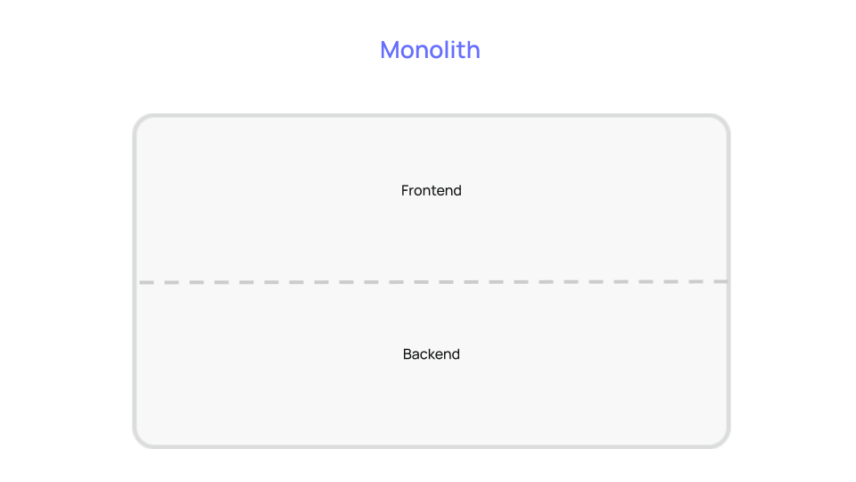
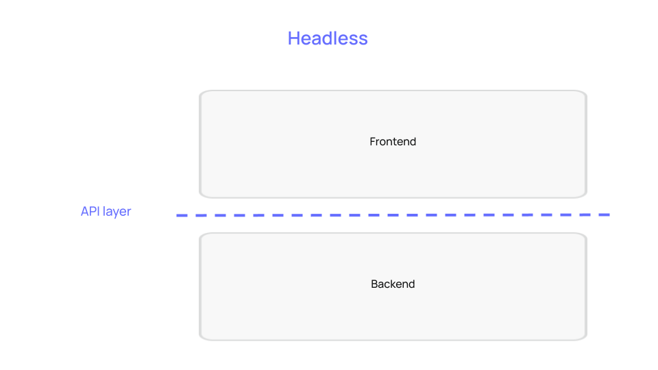
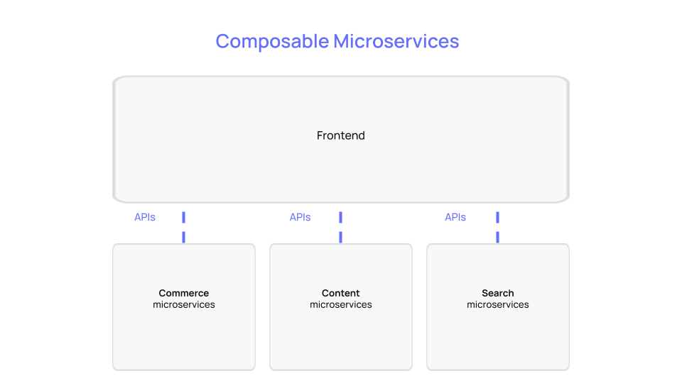
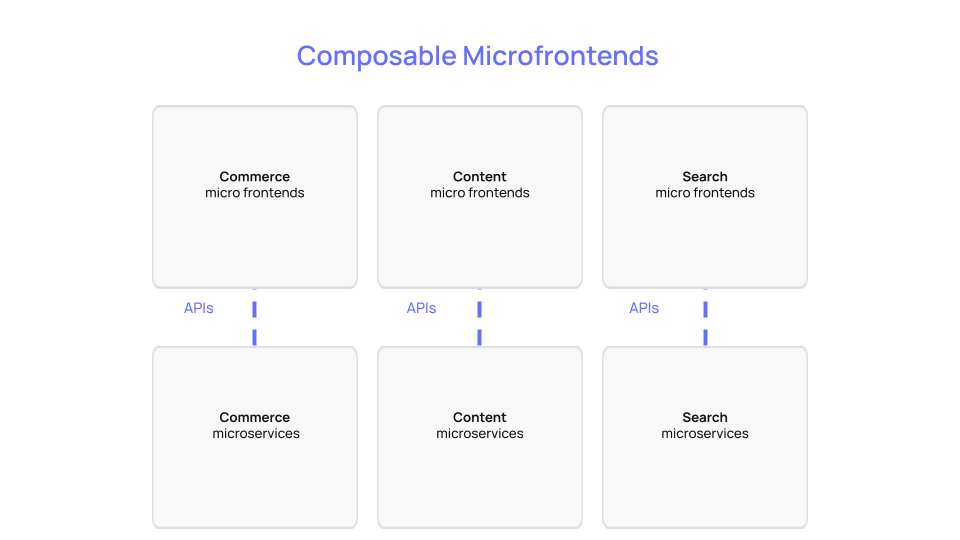

# Building an Ecommerce Solution with Commerce Layer Demo Stores

Digital commerce is evolving, and to meet up with the increasing demands of customers, there is a need for businesses to build better shopping experiences. In this workshop, you will learn how **composable commerce APIs** and **micro-frontends** enable better developer/customer experience by building a completely static ecommerce solution with Commerce Layer, Nextjs, and some other dev tools.

## TOCs

- [🎧 Overview](#-overview)
- [🛠 Prerequisites](#-prerequisites)
- [🧱 Introduction to Composable Commerce](#-introduction-to-composable-commerce)
- [🥂 Introduction to Microfrontends](#-introduction-to-microfrontends)
- [🛒 Introduction to Commerce Layer](#-introduction-to-commerce-layer)
- [👨🏾‍🏫 Workshop Lessons](#-workshop-lessons)
- [🚀 What's Next?](#-whats-next)
- [📑 Further Resources](#-further-resources)

---

## 🎧 Overview

Add the end of this workshop; you should be able to:

- Explain what composable commerce is to your manager and friends.
- Understand what microfrontends are, their benefits (especially in ecommerce), and how they work.
- Understand the benefits of composable commerce to businesses as opposed to previous strategies.
- Understand what Commerce Layer does and how to use the commerce APIs.
- Understand how to set up and use the Demo stores to build any ecommerce solution.
- Understand where to find and how to use other Commerce Layer dev tools.

## 🛠 Prerequisites

- Some JavaScript, command-line, and API knowledge are required.
- A working programming IDE (I use vscode; you can also try it).
- A Commerce Layer account ([create one here](https://dashboard.commercelayer.io/sign_up)).
- You have set up a Commerce Layer organization and created the required commerce data resources for your market. You can follow this [onboarding tutorial](https://docs.commercelayer.io/developers/welcome/onboarding-tutorial) or [manual configuration guide](https://docs.commercelayer.io/developers/welcome/manual-configuration) to achieve this (**you must do this before attending the workshop**).
- Study these [data models](https://commercelayer.io/docs/data-model) to understand the key API entities, their mutual relationships, and common usage in Commerce Layer.

## 🧱 Introduction to Composable Commerce

Composable commerce allows developers to review, select, and utilize various available commerce solutions as required to satisfy specific business needs. Developers can compose their development stack by selecting best-of-breed tools. Either from Jamstack tools, API-first solutions, headless solutions, composable microservices, or microfrontends.

A composable commerce solution includes:

- Individual components (that are autonomously developed, deployed, and managed) targeted toward specific business requirements.
- APIs connecting each of these individual components.
- The front-end presentation layer decoupled from the backend logic.
- Integration with reliable API-first external services.
- SAAS and cloud computing services.
- Real-time data can be shared between applications with webhooks.
- Possibilities to build any independent and agnostic internal application on top of the existing data and composable architecture.

## 🥂 Introduction to Microfrontends

Microfrontends extend the composability of microservices to the presentation layer, enabling maximum flexibility.

The following microfrontends are used in developing the Demo Stores project:

- [React Components](https://github.com/commercelayer/commercelayer-react-components)
- [Hosted Cart](https://github.com/commercelayer/commercelayer-cart)
- [Hosted Checkout](https://github.com/commercelayer/commercelayer-react-checkout)

## 🛒 Introduction to Commerce Layer

[Commerce Layer](https://commercelayer.io) is a composable commerce API for developers and brands. Whether you’re building a single-product store or an international ecommerce website to process millions of orders, Commerce Layer provides all the [APIs](https://docs.commercelayer.io/core/v/api-reference) and [developer tools](https://commercelayer.io/developers) you need to make any digital experience shoppable, anywhere.

You can build a multi-language sales channel with your favorite web/mobile/CMS frameworks; then, add Commerce Layer for multi-currency prices, distributed inventory, localized payment gateways, promotions, orders, subscriptions, and much more.

## 👨🏾‍🏫 Workshop Lessons

1. [Introducing Demo Stores](./lessons/01.md)
2. [Getting Started with Commerce Layer](./lessons/02.md)
3. [Installing and Configuring Demo Stores](./lessons/03.md)
4. [Deploying the Ecommerce Solution](./lessons/04.md)
5. [An Overveiw of Ecommerce Data Models](./lessons/05.md)

## 🚀 What's Next?

- Build something nice for fun or that business idea you've always had and start selling!
- Join the [Slack community](https://slack.commercelayer.app)  to interact with Commerce Layer developers, staff, partners, and customers.
- Open a new [Q&A discussion](https://github.com/commercelayer/demo-store-core/discussions/categories/q-a) in the Demo Stores repository.
- Contribute to the development of Demo Stores, Microstores, or other Commerce Layer OSS projects.
- Ping us on Twitter [@commercelayer](https://twitter.com/commercelayer).

## 📑 Further Resources

- [Composable Commerce Guide](https://commercelayer.io/docs/core-concepts/composable-commerce)
- [Micro Frontends Comprehensive Guide](https://micro-frontends.org)
- [Commerce Layer Developer Resources](https://commercelayer.io/developers)
- [Commerce Postman Collections](https://www.postman.com/commercelayer)
- [Commerce Layer OSS Projects](https://github.com/commercelayer)
- [Introducing Microstores](https://commercelayer.io/blog/introducing-microstores)
